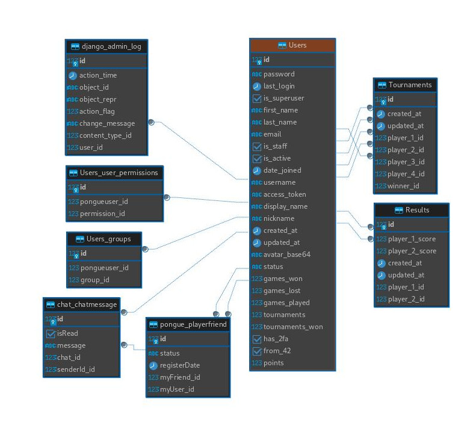

# PONGUE (ft_transcendence)
This project features an online Pong game built with modern web technologies. We used Docker to orchestrate the various containers, Django to power the backend, Caddy as the web server, Postgres as the database, and Redis for efficient channel layer management.

## Project architecture diagram


## Project database diagram


## System Requirements

To run this project, you will need the following software installed on your machine:

- **Docker**: Version 27.2.0 or higher
- **Make**: GNU Make 4.3

## Installation

1. **Clone the repository:**

   ```bash
   git clone https://github.com/fmanzanare/ft_trascendence.git
   ```

2. **Navigate to the project directory:**

   ```bash
   cd ft_trascendence
   ```

3. **Run the Project:**

   ```bash
   make
   ```

## Usage

Once the project is running, access the game by navigating to https://localhost:4000 in your web browser.
   
## Completed modules.

This project is part of curriculum 42 and consists of several modules designed to cover different aspects of software development. For this project, we have chosen the following modules:

- **42 API Connection:** Integration with the 42 API.
- **Microservices:** Microservices-based architecture for greater scalability.
- **JWT + 2FA:** Implementation of JWT authentication with two-factor authentication.
- **Backend Framework (Django):** Robust backend using Django.
- **Bootstrap + DB (PostgreSQL):** Initial database setup and data loading.
- **Graphics / 3D:** Graphics and 3D rendering.
- **Remote:** Remote functionalities for the game.
- **User Statistics:** User statistics module.
- **Server-side PONG:** Server-side implementation of the PONG game.
- **User Management:** User management, including adding friends from the chat.
- **Live Chat:** Live chat functionality.

## Stopping the Server and Cleaning Up

To stop the server and clean up the Docker, follow these steps:

1. **Stop the Server:**
   Press `Ctrl + C` in the terminal where the server is running to stop it.

2. **Remove Docker Volumes:**
   Run the following command to remove Docker volumes:

     ```bash
     make clean_volumes
     ```

3. **Remove All Containers and Networks:**
   Run the following command to remove all containers, networks, and images:

     ```bash
     make clean_all
     ```

This ensures that all resources associated with the project are cleaned up properly.